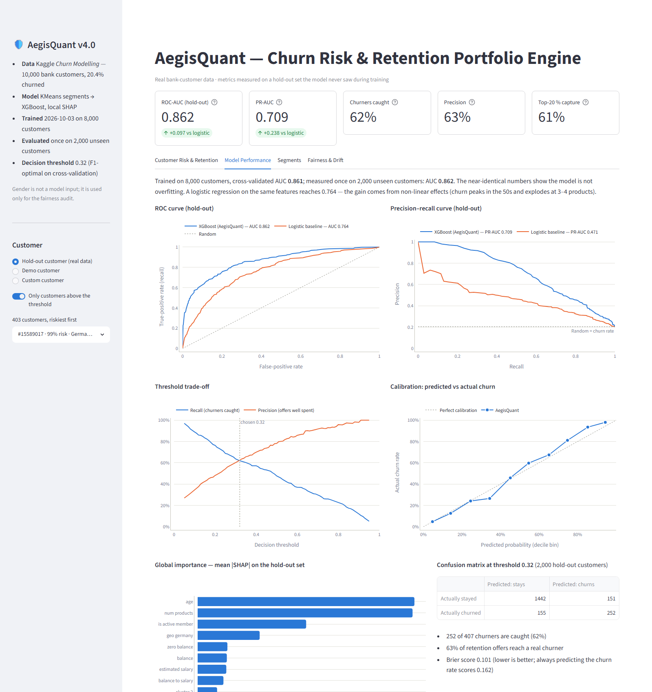
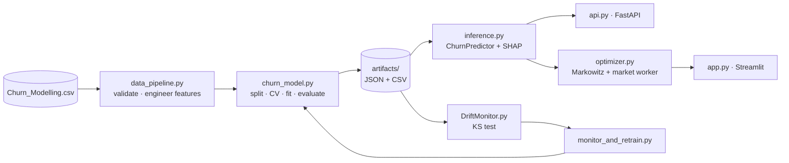

# AegisQuant v4.0 — AI Portfolio Shield & Risk Engine

**Churn prediction with per-customer explanations, KMeans investor segmentation and a churn-adjusted
Markowitz retention portfolio — now trained and evaluated on real bank-customer data.**


AegisQuant scores how likely a bank customer is to leave, explains *why* in plain language (local SHAP),
maps the customer to an investor profile, and — when the risk crosses a learned threshold — proposes a
personalised, risk-adjusted investment allocation as a retention offer. Higher churn risk makes the
proposed portfolio calmer: customers in distress are not offered volatility.

## Results (hold-out set, 2,000 customers never seen in training)

| Metric | AegisQuant (XGBoost) | Logistic-regression baseline |
|---|---|---|
| ROC-AUC | **0.862** | 0.765 |
| PR-AUC (random = 0.204) | **0.709** | 0.471 |
| Recall / precision at the chosen threshold (0.32) | **62 % / 63 %** | 62 % / 40 % |
| Churners found in the riskiest 20 % of customers | **61 %** | 47 % |
| Brier score (lower is better; constant = 0.162) | **0.101** | — |

- 5-fold cross-validated AUC on the training split is **0.861** — matching the hold-out score, so the
  model is not overfitting.
- Predictions are **calibrated**: customers scored 40–50 % churn 46 % of the time.
- The gain over the baseline comes from non-linear effects a linear model cannot express: churn peaks
  in the 50s (56 %) and jumps to 83–100 % for customers holding 3–4 products.

**Segments** (KMeans on age, balance, salary → investor profile by risk capacity):

| Profile | Customers | Churn rate | Avg age | Avg balance |
|---|---|---|---|---|
| Conservative | 16 % | **46 %** | 57 | €91K |
| Balanced | 34 % | 12 % | 36 | €2K (95 % zero balance) |
| Aggressive | 50 % | 17 % | 35 | €123K |

**Fairness:** gender is *not* a model input. On the hold-out set the model catches 61 % of female and
63 % of male churners (equal-opportunity check), with ROC-AUC 0.867 vs 0.857.



## Dataset

[Kaggle "Churn Modelling"](https://www.kaggle.com/datasets/shrutimechlearn/churn-modelling) —
10,000 customers of a European bank (France, Germany, Spain), 20.4 % of whom left (`Exited = 1`).
Stored at `data/Churn_Modelling.csv`; it is a public dataset — check its Kaggle page for licence terms
before reusing it elsewhere.

| Column | Use |
|---|---|
| CreditScore, Age, Tenure, Balance, NumOfProducts, HasCrCard, IsActiveMember, EstimatedSalary, Geography | model inputs |
| Gender | **fairness audit only** — deliberately excluded from the model |
| Exited | target |
| RowNumber, CustomerId, Surname | identifiers — dropped (CustomerId is kept only to look customers up) |

`load_churn_dataset()` validates the schema and fails loudly on missing values, duplicate customers or
unknown markets instead of silently imputing.

## What changed in v4.0

| Area | v3.2 | v4.0 |
|---|---|---|
| Data | Synthetic generator; the label was a known formula of its own features | Real Kaggle bank data with a real churn label |
| Evaluation | Fitted on **all** rows, then scored on a subset of them (in-sample AUC 0.87) | Stratified 80/20 split; test set used once; CV for model selection |
| Decision threshold | Fixed 0.50 | F1-optimal on out-of-fold predictions (0.32) |
| Serialisation | Said "no pickle" but still wrote a pipeline pickle + 2 joblib files | JSON and CSV only (booster, centroids, profile map, metadata) |
| Explanations | SHAP top-2 by name | SHAP drivers with the customer's own values and dataset context |
| Inference code | Duplicated in `api.py` and `optimizer.py` | One shared `ChurnPredictor` (`inference.py`) |
| Optimiser bounds | From synthetic crypto/tech ratios | From the KMeans investor profile; defensive core (SPY, BND, GLD, KO) |
| Quality checks | Manual `requests` script | 30 pytest tests (data, model, SHAP, optimiser, API, drift, dashboard) |
| Docker | `python:3.10` (incompatible with pandas 3) | `python:3.12-slim`, model trained at build, non-root user |

## Architecture



| File | Role |
|---|---|
| `config.py` | Paths, feature lists, hyperparameters, asset universe, `ClientFeatures` contract |
| `data_pipeline.py` | Loading/validation, feature engineering (shared by training and serving), `DynamicProfileResolver` |
| `feature_cross_pollination.py` | `ClusterInjector` (KMeans → one-hot), `XGBWithValidation`, pickle-free `ProcessorBundle`, artifact I/O |
| `churn_model.py` | Training & evaluation protocol, reports, `models_log.json` |
| `inference.py` | `ChurnPredictor`: probability, risk tier, profile, local SHAP drivers |
| `optimizer.py` | `AegisQuantEngine`: yfinance worker, Ledoit-Wolf covariance, churn-scaled SLSQP Markowitz |
| `api.py` | REST API |
| `app.py` | Dashboard |
| `DriftMonitor.py`, `monitor_and_retrain.py` | Drift detection and scheduled retraining |
| `tests/` | 30 tests |

## Quick start (Windows / PowerShell)

```powershell
git clone https://github.com/Har-Khachatryan/aegisquant-engine.git
cd aegisquant-engine
python -m venv aegis_env
aegis_env\Scripts\activate          # Linux/macOS: source aegis_env/bin/activate
pip install -r requirements-dev.txt

python churn_model.py               # train + evaluate (~30 s); artifacts → artifacts/
streamlit run app.py                # dashboard → http://localhost:8501
uvicorn api:app --port 8000         # API → http://localhost:8000/docs
python -m pytest -q                 # 30 tests
```

The dashboard and API train automatically on first start if `artifacts/` is missing. Set
`AEGIS_OFFLINE=1` to run the dashboard without internet (the portfolio then uses a clearly labelled
synthetic covariance instead of yfinance data).

## API

| Method | Path | Returns |
|---|---|---|
| `GET` | `/` | redirect to `/docs` |
| `GET` | `/health` | status, model version, test AUC, decision threshold |
| `GET` | `/model-card` | training metadata, hold-out metrics, fairness audit, segments |
| `POST` | `/predict` | churn probability, risk tier, retention decision, investor profile, SHAP drivers |

```json
POST /predict
{
  "credit_score": 619, "geography": "Germany", "age": 52, "tenure": 2,
  "balance": 118000, "num_products": 3, "has_cr_card": true,
  "is_active_member": false, "estimated_salary": 101348.88
}
```

```json
{
  "churn_probability": 0.9839,
  "risk_tier": "High",
  "retention_action": true,
  "decision_threshold": 0.32,
  "investor_profile": "conservative",
  "segment_id": 1,
  "risk_drivers": [
    "Products held: 3 — raises churn risk (customers with 3–4 products churn 83–100 %)",
    "Age: 52 — raises churn risk (churn peaks between 45 and 60, reaching 56 % in the 50s)"
  ],
  "drivers": [{"feature": "num_products", "value": 3.0, "contribution": 2.9181, "...": "..."}],
  "base_value": -1.3715,
  "model_version": "aegis_quant_v4.0 (trained 2026-10-03)"
}
```

Invalid input (e.g. `credit_score: 100`, `geography: "Italy"`, `num_products: 5`) returns **422**.

## Methodology

**Features.** Raw inputs plus engineered `geo_germany`, `geo_spain` (France = baseline),
`balance_to_salary`, `zero_balance` (36 % of customers hold no balance) and `tenure_to_age` (loyalty
relative to adult life). `engineer_features()` is the single implementation used by training, the API
and the dashboard; a test asserts the serving path reproduces the training matrix exactly.

**Cross-pollination.** KMeans (k = 3) segments customers on standardised age, balance and salary; the
one-hot segment is appended to the XGBoost inputs. Segments are labelled by risk capacity
`z(balance) − z(age)` computed from the centroids, so labels survive retraining.

**Model.** XGBoost (depth 4, learning rate 0.03, early stopping on an internal 20 % split) with one
monotonic constraint — active members churn less — where the data clearly supports it; age and product
count are left unconstrained because their effects are non-monotonic.

**Protocol.** Stratified 80/20 split → 5-fold out-of-fold predictions on the 80 % pick the
F1-optimal threshold → final fit on the 80 % → one evaluation on the 20 %, against a logistic baseline.

**Explanations.** `shap.TreeExplainer` gives exact per-customer contributions in log-odds (a test checks
they sum to the model margin). The API returns the top churn-raising drivers with the customer's values.

**Retention portfolio.** For customers above the threshold:
`max μᵀw − (γ/2)·wᵀΣw − λ‖w − w₀‖²` with Ledoit-Wolf Σ from one year of yfinance prices.
γ is the profile's base risk aversion, multiplied by up to *e* as churn probability rises above the
threshold. Tech and crypto are capped per profile (e.g. conservative ≤ 4 % crypto, ≤ 30 % tech); core
assets carry a profile minimum weight. Expected returns are trailing averages, not forecasts.

**Drift.** Two-sample KS tests on six numeric features against the training data; two or more drifted
features (p < 0.01) trigger `monitor_and_retrain.py`, which reads `data/latest_production_data.csv`.

## Docker

```powershell
docker build -t aegisquant .
docker run --rm -p 8000:8080 aegisquant                       # API
docker run --rm -p 8501:8080 -e SERVICE=dashboard aegisquant  # dashboard
```

The image contains only the engine modules and the Kaggle CSV (`.dockerignore` is an allow-list); the
model is trained during the build and the container runs as a non-root user.

## Limitations

- One public snapshot from a single bank: no time dimension, so "churn" is a static label and the model
  cannot use behavioural trends (logins, balance velocity) that v3.x simulated.
- The threshold optimises F1; a production deployment should optimise expected retention value
  (offer cost vs customer lifetime value) and validate with an A/B hold-out.
- Excluding gender keeps it out of decisions but the model under-predicts women's churn on average
  (22 % predicted vs 25 % actual); correlated features can still act as proxies.
- The portfolio layer is illustrative: trailing returns and a ten-asset universe, not investment advice.

## Also in this repository

[`coinstats_intel/`](coinstats_intel/) — a separate project: portfolio-health analytics for CoinStats
manual crypto portfolios (its dataset is licensed for academic use and is not included).

## Version history

- **v4.0** — real Kaggle bank data, leak-free evaluation protocol, learned threshold, pickle-free
  artifacts, fairness audit, shared predictor, profile-driven optimiser, 30 tests, fixed Docker image.
- **v3.2** — local SHAP explanations, native XGBoost JSON, asynchronous market worker, single
  `ClientFeatures` contract.
- **v3.1** — unified cross-pollination pipeline, feasibility-repair layer, drift monitor.
- **v3.0** — initial modular architecture.
