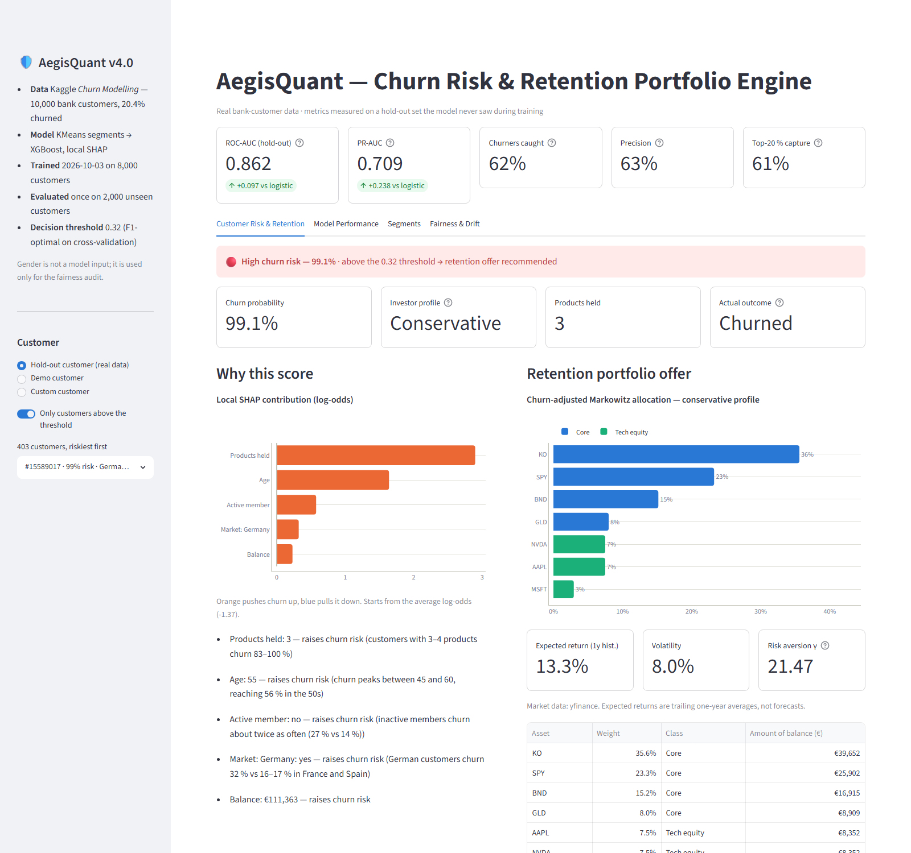
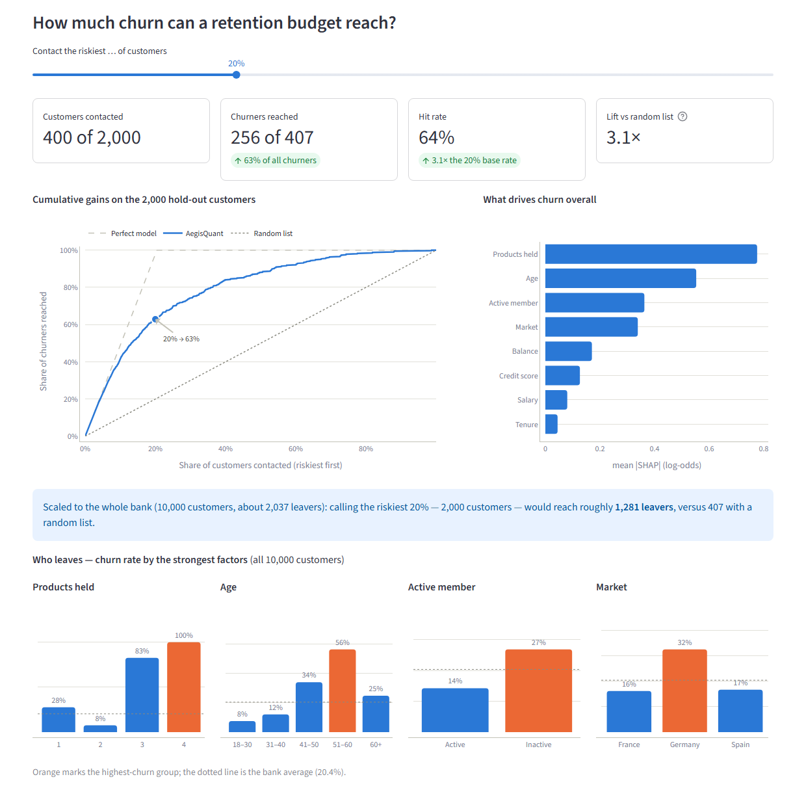
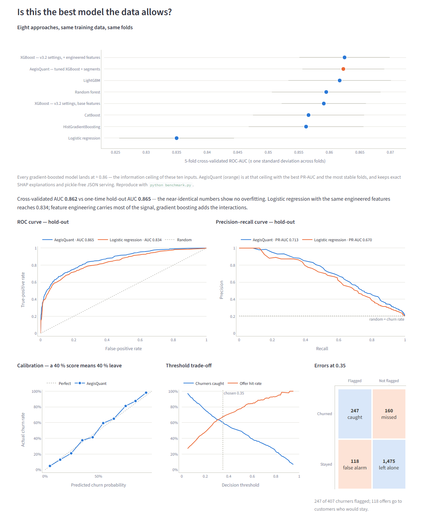
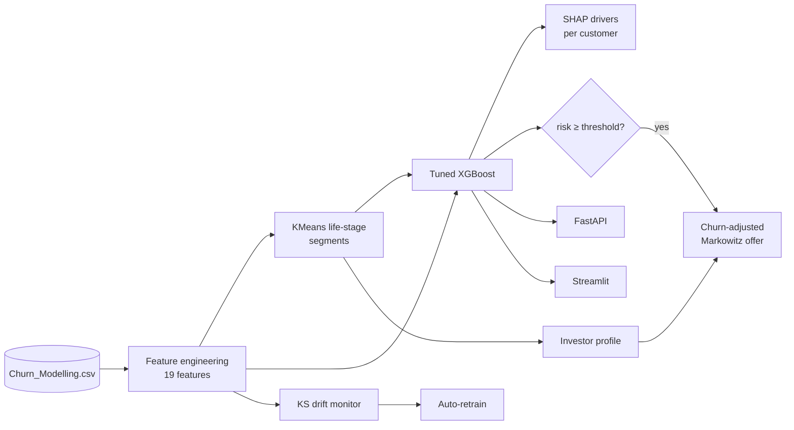

<div align="center">

# 🛡️ AegisQuant

**Churn risk & retention engine for retail banking** — predicts which customers are about to leave,
explains why in plain language, and proposes a risk-adjusted investment offer to keep them.


**[▶ Live dashboard](https://aegisquant-dashboard-kgnu6u2y6a-ew.a.run.app)** ·
**[API docs](https://aegisquant-api-kgnu6u2y6a-ew.a.run.app/docs)**
<br><sub>Hosted on Google Cloud Run — the first visit can take ~30 s while the service wakes up.</sub>

</div>



## Results

Measured once on **2,000 customers the model never saw** (Kaggle *Churn Modelling*, 10,000 bank customers).

| | |
|---|---|
| **ROC-AUC** | **0.865** (5-fold CV on training data: 0.862 — no overfitting) |
| **Churners caught · offer hit-rate** | **61 % · 68 %** at the learned threshold |
| **Riskiest 20 % of customers** | contain **63 % of all churners** — 3.1× a random call list |
| **Calibration** | scores are honest probabilities: customers scored 55 % left 59 % of the time |
| **Fairness** | gender is deliberately not a model input (a ~0.003-AUC trade-off); churners caught: 60 % of women, 61 % of men |

<sub>Multithreaded XGBoost makes scores vary by about ±0.002 across platforms (the Docker build on Linux
reports ROC-AUC 0.863).</sub>

## Business impact

Rank customers by risk, call the top of the list. With a budget for 20 % of the bank, AegisQuant reaches
**1,281 of ~2,037 leavers** where a random list reaches 407. The dashboard lets you drag the budget and
see the trade-off live.



## Is this the best model the data allows?

Eight approaches, same training data, same folds (`python benchmark.py`):

| Model | 5-fold CV ROC-AUC | CV PR-AUC |
|---|---|---|
| **AegisQuant — tuned XGBoost + engineered features + segments** | 0.862 ± 0.007 | **0.701** |
| XGBoost, v3.2 settings + engineered features | 0.863 ± 0.007 | 0.699 |
| LightGBM | 0.862 ± 0.008 | 0.699 |
| Random forest | 0.860 ± 0.009 | 0.690 |
| XGBoost, v3.2 settings, base features | 0.859 ± 0.007 | 0.694 |
| CatBoost | 0.857 ± 0.009 | 0.693 |
| HistGradientBoosting | 0.856 ± 0.009 | 0.693 |
| Logistic regression (same engineered features) | 0.835 ± 0.009 | 0.657 |

Every gradient-boosted model converges at **≈ 0.86 — the information ceiling of these ten inputs**
(scores far above it on this dataset usually come from leakage, e.g. oversampling before the split).
AegisQuant sits at that ceiling with the best PR-AUC and the most stable folds, while keeping exact SHAP
explanations and pickle-free JSON serving. Feature engineering is where the signal is: on the hold-out set
it lifts plain logistic regression from 0.765 to 0.834.



## How it works



- **Features** — raw bank fields plus six engineered signals that each raised cross-validated AUC: single
  vs. 3–4 products, inactive 45+ (67 % churn), age × activity, market × balance, credit score per year of
  age, balance/salary and tenure/age.
- **Segments** — KMeans on age, balance and salary; each segment maps to a conservative / balanced /
  aggressive investor profile by risk capacity, derived from the centroids so it survives retraining.
- **Model** — XGBoost tuned by a 30-trial random search on CV, early stopping, one monotonic constraint
  (active members churn less). Decision threshold: F1-optimal on out-of-fold predictions.
- **Explanations** — exact TreeSHAP values, summed per business concept ("Products held", "Active
  member", …) and phrased with the customer's own values and the relevant churn base rate.
- **Retention offer** — mean-variance optimisation on ten assets (Ledoit-Wolf covariance from yfinance)
  with profile caps on tech and crypto; risk aversion rises with churn risk, so a distressed customer is
  offered a calmer portfolio.
- **MLOps** — leak-free protocol (test set used once), JSON-only artifacts, KS drift monitor with an
  automatic retraining trigger, 31 tests, Docker image trained at build time.

## Quick start

```bash
git clone https://github.com/Har-Khachatryan/aegisquant-engine.git
cd aegisquant-engine
python -m venv aegis_env && aegis_env\Scripts\activate    # macOS/Linux: source aegis_env/bin/activate
pip install -r requirements-dev.txt

python churn_model.py          # train + evaluate (~30 s) → artifacts/
streamlit run app.py           # dashboard → http://localhost:8501
uvicorn api:app --port 8000    # REST API → http://localhost:8000/docs
python -m pytest -q            # 31 tests
```

The app trains itself on first start if `artifacts/` is missing. `AEGIS_OFFLINE=1` runs the dashboard
without internet (the offer then uses a clearly labelled synthetic covariance).

```bash
docker build -t aegisquant .
docker run -p 8000:8080 aegisquant                        # API
docker run -p 8501:8080 -e SERVICE=dashboard aegisquant   # dashboard
```

**Google Cloud Run** — `cloudbuild.yaml` builds the image once and deploys both services (one image,
`SERVICE=api|dashboard`), running as a service account with no project roles and capped at two instances.
`.gcloudignore` is an allow-list, so only the engine and the Kaggle CSV are uploaded. The command and the
required build-account roles are in the file header.

## API

`POST /predict`

```json
{"credit_score": 619, "geography": "Germany", "age": 52, "tenure": 2, "balance": 118000,
 "num_products": 3, "has_cr_card": true, "is_active_member": false, "estimated_salary": 101348.88}
```

```json
{
  "churn_probability": 0.9836,
  "risk_tier": "High",
  "retention_action": true,
  "decision_threshold": 0.35,
  "investor_profile": "conservative",
  "risk_drivers": [
    "Products held: 3 — raises churn risk (customers with 3–4 products churn 83–100 %)",
    "Age: 52 — raises churn risk (churn peaks between 45 and 60, reaching 56 % in the 50s)"
  ],
  "drivers": [{"feature": "num_products", "value": "3", "contribution": 2.7303, "...": "..."}],
  "model_version": "aegis_quant_v4.0 (trained 2026-10-03)"
}
```

Also: `GET /health`, `GET /model-card` (metrics, fairness audit, segments). Invalid input returns `422`.

## Project structure

| File | Role |
|---|---|
| `config.py` | Paths, features, tuned hyperparameters, asset universe, `ClientFeatures` contract |
| `data_pipeline.py` | Validated loading, feature engineering (shared by training and serving), profile resolver |
| `feature_cross_pollination.py` | KMeans → XGBoost pipeline, pickle-free serving bundle, SHAP grouping |
| `churn_model.py` | Training & evaluation protocol |
| `benchmark.py` | Reproducible model comparison and hyperparameter search |
| `inference.py` | `ChurnPredictor`: probability, risk tier, profile, explanations |
| `optimizer.py` | Market-data worker and churn-adjusted Markowitz optimiser |
| `api.py` · `app.py` | FastAPI service · Streamlit dashboard |
| `DriftMonitor.py` · `monitor_and_retrain.py` | Drift detection · scheduled retraining |
| `tests/` | 31 tests: data, train/serve parity, model quality, SHAP additivity, optimiser, API, dashboard |

## Dataset

[Kaggle — Churn Modelling](https://www.kaggle.com/datasets/shrutimechlearn/churn-modelling): 10,000
customers of a European bank (France, Germany, Spain), 20.4 % churned. Included as
`data/Churn_Modelling.csv`; check the Kaggle page for its licence before reuse. `RowNumber` and `Surname`
are dropped, `Gender` is kept only for the fairness audit.

<details>
<summary><b>What changed in v4.0</b></summary>

| | v3.2 | v4.0 |
|---|---|---|
| Data | Synthetic generator | Real Kaggle bank customers |
| Evaluation | Scored on rows the model had trained on | Stratified 80/20 split, test set used once, CV for every choice |
| Model | Fixed hyperparameters, 7 synthetic features | Tuned XGBoost, 19 features, learned threshold |
| Explanations | Top-2 SHAP feature names | Grouped SHAP drivers with values and base rates |
| Serialisation | Pickle + joblib | JSON / CSV only |
| Quality | Manual request script | 31 automated tests, model benchmark, fairness audit |
| Docker | `python:3.10` (incompatible with pandas 3) | `python:3.12-slim`, trained at build, non-root |

</details>

## Limitations

- One static snapshot from one bank: no behavioural time series (logins, balance trends), which caps
  achievable accuracy.
- The threshold maximises F1; production should optimise retention value (offer cost vs. customer
  lifetime value) and confirm uplift with an A/B hold-out.
- Without gender as an input the model slightly under-predicts women's churn (22 % vs 25 % actual);
  correlated features can still act as proxies.
- The portfolio layer is illustrative (trailing returns, ten assets) — not investment advice.

## License

Code: [MIT](LICENSE). The dataset is not covered by this licence — it remains under the terms of its
Kaggle page.

---

<sub>Also in this repository: [`coinstats_intel/`](coinstats_intel/) — a separate portfolio-health
analytics project for CoinStats crypto portfolios. · Version history: **v4.0** real data & leak-free
evaluation · **v3.2** local SHAP, native XGBoost JSON · **v3.1** cross-pollination pipeline · **v3.0** modular
architecture.</sub>
