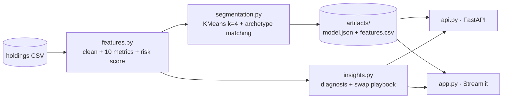

# CoinStats Portfolio Intelligence

Portfolio-health analytics for CoinStats manual portfolios: **feature engineering → KMeans investor
archetypes → capitulation (attrition) vulnerability score → risk-reducing In-App Swap playbook**,
served as a **FastAPI** backend and a **Streamlit** executive dashboard, packaged as one Docker image
for **Google Cloud Run**.

Built on `data/coinstats_manual_portfolios_holdings.csv` (500 portfolios, 8,216 holdings).

> **The dataset is not in this repository.** It is licensed for academic use only and must not be
> redistributed, so the repo `.gitignore` excludes it. To run the project, put your own copy at
> `data/coinstats_manual_portfolios_holdings.csv` (repo root) or point `COINSTATS_DATA_PATH` at it.
> Without it the data-dependent tests are skipped.



| File | Role |
|---|---|
| `settings.py` | Every threshold, weight, label and path in one place |
| `features.py` | Holding cleaning, cost-basis sanitisation, portfolio metrics, vulnerability score |
| `segmentation.py` | KMeans, pickle-free JSON model, Hungarian cluster→archetype matching |
| `insights.py` | Per-portfolio diagnosis, swap levers, campaign sizing |
| `pipeline.py` | Offline build: CSV → `artifacts/` (auto-runs if artifacts are missing/stale) |
| `api.py` | REST API |
| `app.py` | Executive dashboard |
| `tests/` | 24 tests: unit, segmentation, end-to-end API, dashboard smoke test |
| `start_demo.cmd` | One-click tunnels to the private Cloud Run services (Windows) |

## Quick start (Windows / PowerShell, from the repo root)

```powershell
cd coinstats_intel
..\aegis_env\Scripts\Activate.ps1          # or any venv with: pip install -r requirements.txt

python pipeline.py                         # build artifacts (~2 s) and print the segment summary
streamlit run app.py                       # dashboard → http://localhost:8501
uvicorn api:app --reload --port 8000       # API       → http://localhost:8000/docs
```

Tests (`pip install pytest` first):

```powershell
python -m pytest -q
```

## API

| Method | Path | Returns |
|---|---|---|
| `GET` | `/` | redirect to the interactive docs at `/docs` |
| `GET` | `/health` | status, model version, training date, silhouette |
| `POST` | `/analyze-portfolio` | HHI, PnL %, archetype, attrition vulnerability score, risk tier, drivers, push copy |
| `GET` | `/cluster-summary` | book KPIs + per-archetype statistics over the 500 portfolios |
| `GET` | `/portfolios/{portfolio_id}` | the same analysis for a reference portfolio (demo helper) |

```powershell
$body = @{
  portfolio_id = "demo"
  holdings = @(
    @{ coin_id="bitcoin";  symbol="BTC";  rank=1; amount=0.5;   price_usd=82898.66; avg_buy_price_usd=63000 },
    @{ coin_id="bonk";     symbol="BONK"; rank=212; amount=4e7; price_usd=0.0000034; avg_buy_price_usd=0.000021 }
  )
} | ConvertTo-Json -Depth 4
Invoke-RestMethod -Uri http://localhost:8000/analyze-portfolio -Method Post -Body $body -ContentType "application/json"
```

`value_usd` is never sent — the API recomputes `amount × price_usd` so clients can't submit
inconsistent values. `avg_buy_price_usd` is optional.

## Methodology

### Portfolio features

| Feature | Definition |
|---|---|
| `total_portfolio_value` | Σ value_usd |
| `num_assets` | distinct coins |
| `unrealized_pnl_usd` | Σ (price − avg_buy) × amount, **trusted cost basis only** |
| `unrealized_pnl_pct` | unrealized_pnl_usd / total_cost_basis × 100 (null if basis covers < 50 % of value) |
| `hhi_index` | Σ weight² — 1/n = evenly spread, 1 = single coin |
| `top1_weight`, `top3_weight` | share of the largest 1 / 3 holdings |
| `top10_bluechip_ratio` | share in coins ranked ≤ 10 |
| `speculative_meme_ratio` | share in coins ranked > 100 |
| `weighted_market_rank` | Σ weight × rank |
| `capitulation_vulnerability_score` | see below |

Also computed: `stablecoin_ratio` (stablecoins rank top-10, so they are tracked separately as
"dry powder"), `effective_num_assets` (1/HHI), `dust_positions`, `cost_basis_coverage`.

### Cost-basis sanitisation

Manual portfolios contain typos — one portfolio entered *total cost* as unit price for every coin
(SHIB "bought" at $2,017), another ETH at $75.8M. Left in, **131 such holdings fabricate
$1.28 trillion of cost basis** against an ~$89M book. A holding's basis is trusted only if
`avg_buy / price` sits inside a rank-aware band: ≤ 100× for top-100 coins (they can't realistically
fall 99 % below a real entry), ≤ 1000× for the long tail (which genuinely can), and ≥ 1/1000.
Untrusted holdings still count toward value and concentration, just not PnL.

### Capitulation vulnerability score (0–100)

```
score = 100 × (0.45·L + 0.25·C + 0.30·S)
L = logistic loss pressure,          0.5 at PnL −20 %   (0 when PnL is unreliable)
C = logistic concentration pressure, 0.5 at HHI 0.50
S = logistic speculation pressure,   0.5 at 35 % in rank>100 coins
```

Tiers: **High ≥ 60**, Elevated 40–60, Low < 40. A separate `triple_threat` flag marks portfolios
meeting all three hard rules at once (PnL < −20 %, HHI > 0.5, > 30 % speculative).
This is a transparent **rules-based proxy** — there are no churn labels in the dataset. With
CoinStats retention data the same features train a supervised model and the weights become learned.

### Segmentation

KMeans (k = 4, 50 inits) on standardised `log10(value)`, `log1p(num_assets)`, `hhi_index`,
`top10_bluechip_ratio`, `speculative_meme_ratio`, `log10(weighted_market_rank)`. Logs stop a
504-coin portfolio or rank-25,000 tokens from claiming a cluster on their own. Each archetype declares
a centroid "signature" and clusters are matched one-to-one by the Hungarian algorithm, so labels stay
correct if KMeans renumbers clusters on retrain. Silhouette is 0.235 — segments overlap at the edges,
which is normal for behavioural data.

The model is saved as **plain JSON** (scaler means/scales + centroids). Inference is a nearest-centroid
lookup in NumPy, verified in tests to match `KMeans.predict` exactly — no pickle, no sklearn version lock.

## Results on the 500-portfolio snapshot

| Archetype | Portfolios | AUM share | Median value | Median PnL | High-risk |
|---|---|---|---|---|---|
| Blue-Chip Whale / Bitcoin Hodler | 127 | 70 % | $119.9K | +18.6 % | 1 |
| Diversified Altcoin Explorer | 123 | 19 % | $31.2K | −16.3 % | 18 |
| High-Risk Speculative Degen | 113 | 8 % | $4.1K | −11.0 % | 49 |
| Micro Retail / Concentrated Novice | 137 | 3 % | $6.9K | +11.4 % | 10 |

Book: ≈ $89.4M AUM · avg HHI 0.42 · median PnL +4.9 % · 78 High-risk (15.6 % of users, 2.4 % of AUM) ·
16 triple-threat.

## Docker

Build from the **repo root** (the CSV lives in `data/`):

```powershell
docker build -f coinstats_intel/Dockerfile -t coinstats-intel .
docker run --rm -p 8501:8080 coinstats-intel                   # dashboard
docker run --rm -p 8000:8080 -e SERVICE=api coinstats-intel    # API
```

One image serves either app (`SERVICE=dashboard|api`); the model is trained at build time.
`Dockerfile.dockerignore` allow-lists the build context, so only this package and the one CSV are sent.

## Deploy to Google Cloud Run

> **Keep both services private.** `data/README.md` licenses the dataset for academic use only, not for
> redistribution; the image contains it. `cloudbuild.yaml` deploys with `--no-allow-unauthenticated`.

One-time setup (replace `PROJECT_ID`):

```powershell
gcloud config set project PROJECT_ID
gcloud services enable run.googleapis.com cloudbuild.googleapis.com artifactregistry.googleapis.com
gcloud artifacts repositories create coinstats-intel --repository-format=docker --location=europe-west1
$sa = "$(gcloud projects describe PROJECT_ID --format='value(projectNumber)')-compute@developer.gserviceaccount.com"
gcloud projects add-iam-policy-binding PROJECT_ID --member="serviceAccount:$sa" --role=roles/run.admin
gcloud projects add-iam-policy-binding PROJECT_ID --member="serviceAccount:$sa" --role=roles/iam.serviceAccountUser
gcloud projects add-iam-policy-binding PROJECT_ID --member="serviceAccount:$sa" --role=roles/artifactregistry.writer
# Runtime identity with no project roles (the services only read files baked into the image)
gcloud iam service-accounts create coinstats-runtime --project PROJECT_ID
gcloud iam service-accounts add-iam-policy-binding coinstats-runtime@PROJECT_ID.iam.gserviceaccount.com `
  --member="serviceAccount:$sa" --role=roles/iam.serviceAccountUser --project PROJECT_ID
```

Build and deploy both services (from the repo root):

```powershell
gcloud builds submit --config coinstats_intel/cloudbuild.yaml --ignore-file coinstats_intel/.gcloudignore .
```

Open the private dashboard for a presentation through an authenticated local proxy:

```powershell
gcloud run services proxy coinstats-intel-dashboard --region europe-west1 --port 8501
# → http://localhost:8501
```

On Windows, `start_demo.cmd` does this for both services in one double-click: it opens a tunnel
window per service (restarted automatically, because gcloud ends a proxy after ~55 minutes), waits
for both to answer so the audience never sees a cold start, then opens the dashboard and `/docs`.
Edit `PROJECT` at the top of the script if you deploy to another project.

The Cloud Build service account name varies by project setup; if the deploy step fails with a
permissions error, grant the three roles above to the account shown in the build log.

## Limitations & next steps

- **No churn labels** — the score is a calibrated heuristic. Next: join 30/60/90-day activity labels
  and train a supervised model (the AegisQuant XGBoost pipeline in this repo is the template).
- **Single snapshot** — no price history, so no realised volatility or drawdown-from-peak. Next: pull
  history per `coin_id` from the CoinStats API.
- **Approximate AUM** — anonymisation scales each portfolio by 0.5–2×; weights, HHI and PnL % are exact.
- **Swap economics** — fee and conversion are dashboard assumptions; replace with CoinStats actuals and
  validate with a randomised holdout.
